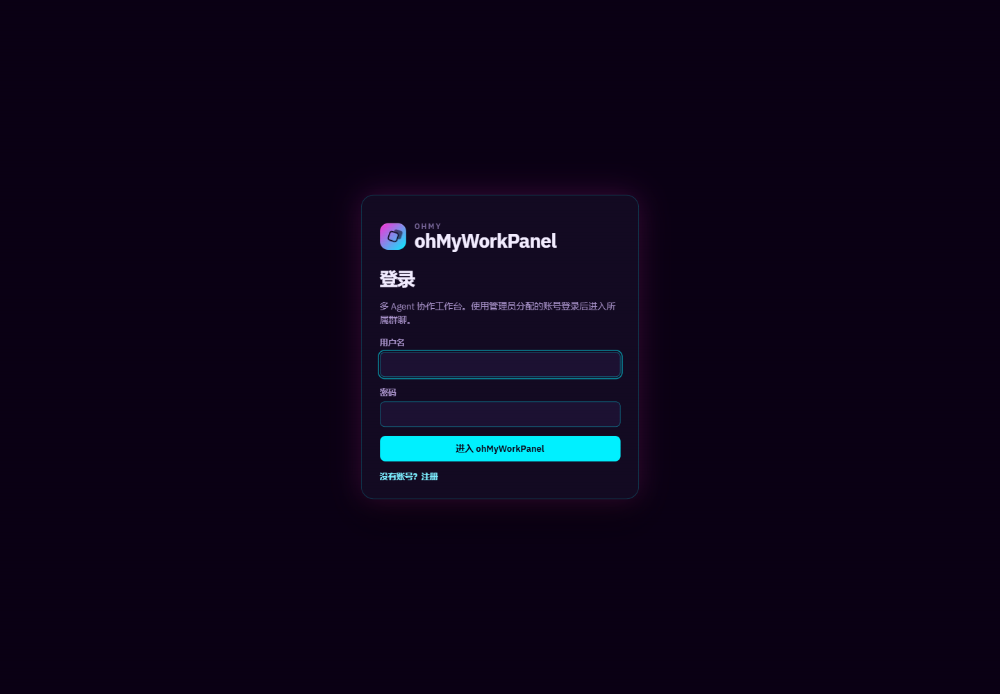
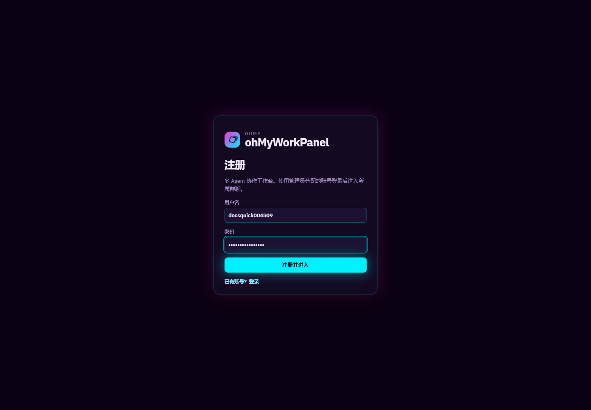
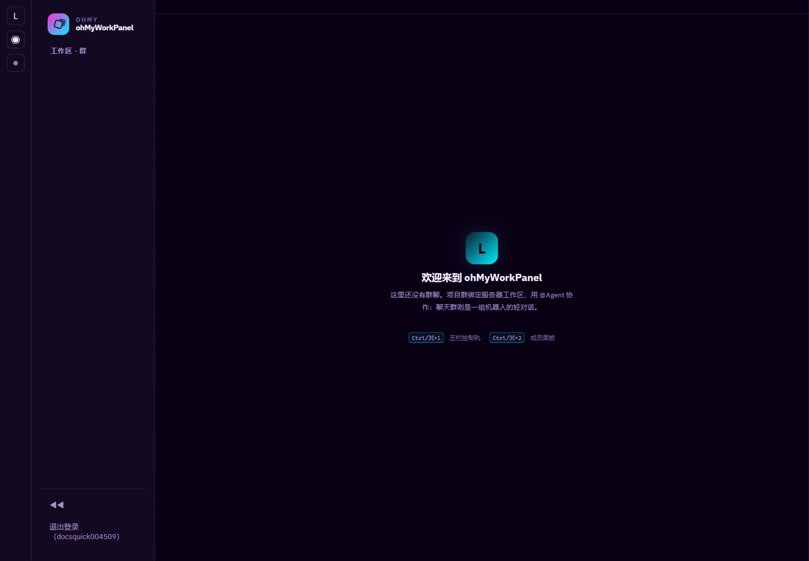
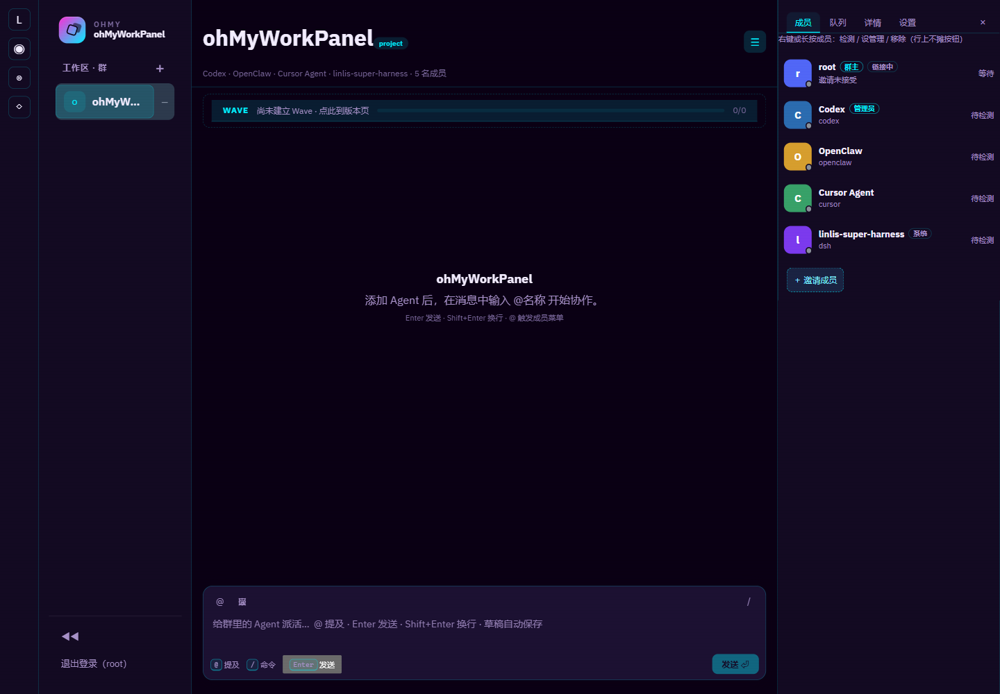
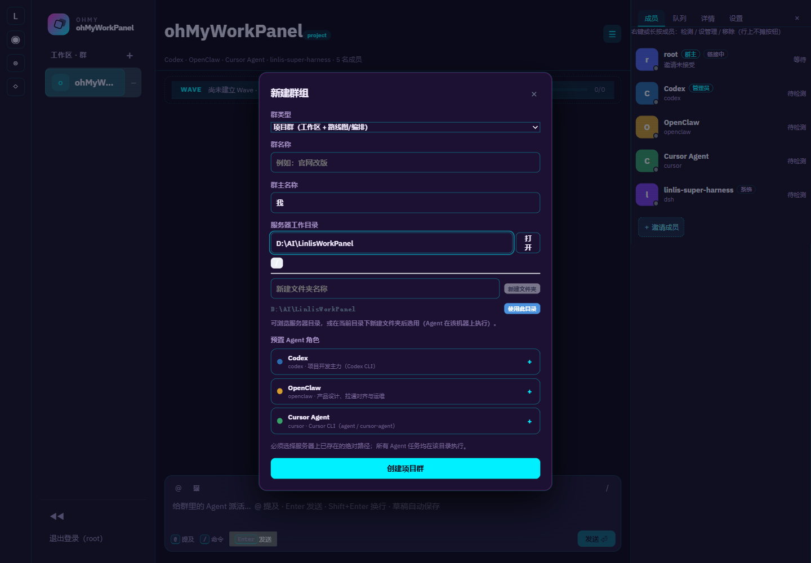
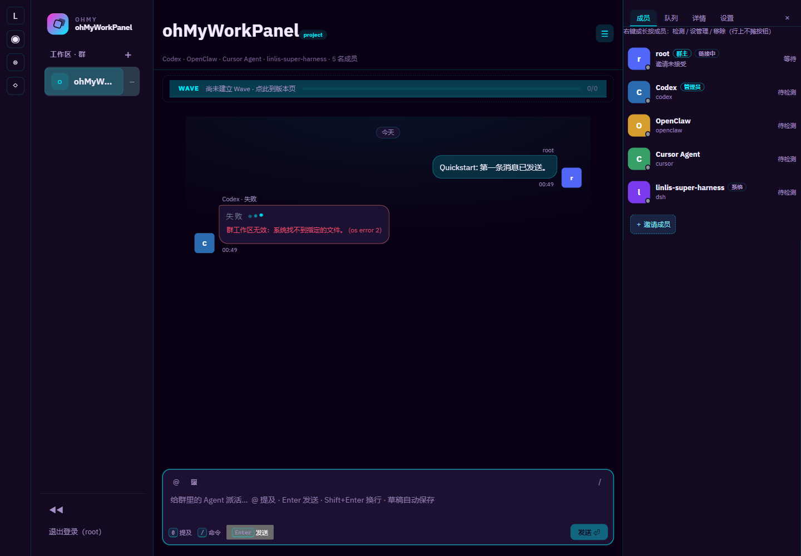
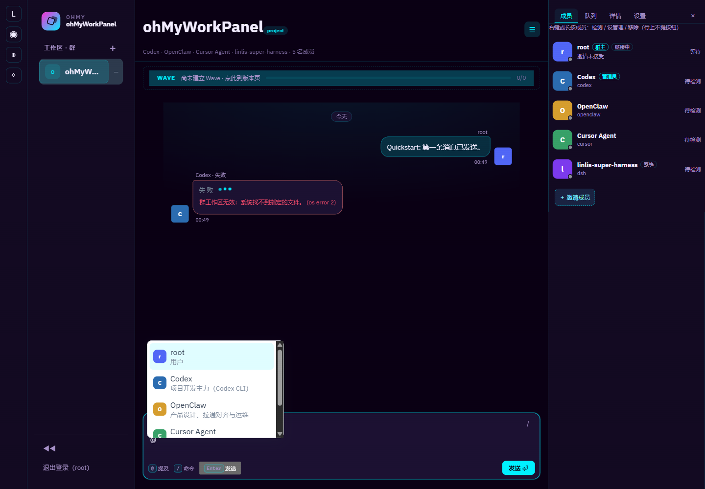

# Tutorial: Run ohMyWorkPanel for the First Time

[简体中文](quickstart.md) | **English**

This tutorial walks through starting the service, registering or signing in, entering a workspace, creating a group, sending a message, and mentioning a member with `@`.

The screenshots come from real local Web pages running the current version. Labels and layout may change between releases; use the screenshots to locate controls, not as a guarantee that every deployment has the same groups or Agents.

## What You Will Complete

```text
Install dependencies → Start the Web service → Sign in → Choose a workspace → Create or enter a group → Send a message → @Agent
```

If you only want to confirm that the frontend opens, use the browser preview. To register, sign in, create groups, and send messages, use the complete Web service.

## 1. Prepare the Environment

Browser preview and the complete Web service require:

- Git;
- Node.js 20 or newer;
- pnpm.

The complete Web service also requires stable Rust. Tauri desktop mode requires the platform dependencies for Tauri; Windows also requires WebView2.

Real Agents are optional. Without an external CLI, use the Mock adapter to verify the UI and task flow first.

## 2. Start ohMyWorkPanel

### Option A: Complete Web service (recommended)

This option includes the Rust backend, SQLite, authentication, groups, and WebSocket. It is the mode used for the screenshots in the rest of this tutorial.

```bash
git clone https://github.com/linlisWorkTeam/ohMyWorkPanel.git
cd ohMyWorkPanel
pnpm install
pnpm run build:web
cd src-tauri
cargo run --no-default-features --bin ohmyworkpanel-server
```

The service listens on `http://127.0.0.1:8080` by default. Open:

<http://127.0.0.1:8080>

Check the service from another terminal:

```bash
curl http://127.0.0.1:8080/api/health
```

Expected response:

```json
{"ok":true,"service":"ohmyworkpanel"}
```

### Option B: Browser development preview

This option starts only Vite. It is useful for frontend development and page preview, but it does not provide the Rust API backend. Login, groups, and Agent features may not work.

```bash
pnpm install
pnpm dev
```

Open <http://127.0.0.1:1420>.

### Option C: Tauri desktop mode

```bash
pnpm install
pnpm tauri dev
```

The command opens a Tauri development window. Before the first run, install stable Rust, the Tauri system dependencies, and WebView2 on Windows.

## 3. Register or Sign In

Open the Web address to see the login page:



### Local demo account

A new data directory initializes a local demo administrator:

```text
Username: root
Password: root
```

Use this account only for local development and screenshots. In a shared or production environment, immediately change, disable, or remove it and use a strong password.

### Register a regular user

Click “Register” and enter a username and password:



After registration, a regular user sees only groups they are authorized to access. Registration does not grant administrator privileges and does not create a project group automatically:



If the page says that there are no chats yet, ask an administrator to add you to a group. Use an administrator account when you need to create a group.

## 4. Understand the Main Interface

After signing in as an administrator, the page has four main areas:

1. Left control rail: switch between major page areas;
2. Group sidebar: view groups, create groups, and sign out;
3. Center workspace: view messages, task status, and compose messages;
4. Right panel: view members, queue, details, and settings.



The Members tab on the right shows users and Agents in the current group. An Agent marked “Not checked” has not completed the environment check; this does not guarantee that it can execute tasks.

## 5. Create a Group

Only administrators can create groups. Click the `+` beside “Workspace · Groups” to open the new-group form:



Fill it in as follows:

1. Choose a group type:
   - **Project group**: binds a workspace and enables project roadmap and orchestration features;
   - **Chat group**: has no workspace and is suitable for people and chatbots.
2. Enter a group name.
3. Enter the group owner name.
4. For a project group, choose a server workspace directory.
5. Optional: click `+` beside a preset Agent role to add it to the new group.
6. Click “Create project group” or “Create chat group”.

### Workspace path rules

A project workspace must:

- be an absolute path on the server running ohMyWorkPanel;
- already exist and be readable and writable by the service process;
- not be a local path on the browser computer;
- not copy the example screenshot path without checking the real server.

For example, a Linux server may use:

```text
/AI/ohMyWorkPanel
```

A Windows server may use:

```text
D:\AI\ohMyWorkPanel
```

Choose a chat group if you want to test messaging without preparing a workspace.

## 6. Send the First Message

Enter a message in the bottom composer and press `Enter`:

```text
Hello. Please confirm that this group can send and receive messages.
```

You can also click the Send button. Use `Shift+Enter` for a new line; drafts are saved automatically.



The screenshot also shows a real Agent failure state. If the group's CLI is not installed, not authenticated, or the workspace is unavailable, the ordinary message can still be sent while the triggered Agent task fails. Check the CLI and workspace permissions before retrying.

## 7. Mention an Agent with `@`

Type `@` in the composer to open the current group member list:



1. Type `@`;
2. Select the Agent from the menu;
3. Continue typing the task;
4. Press `Enter` to send.

Example:

```text
@Codex Check the current workspace test status and report failures.
```

Before running a real Agent, confirm that its CLI is installed and authenticated on the machine running the service. Installation, authentication, and parameters differ by CLI; ohMyWorkPanel schedules the task and displays its result.

## 8. Add and Check an Agent

The Members panel can:

- show users and Agent members;
- invite members;
- open member configuration;
- check an Agent environment;
- show Agent runtime status.

Recommended order for connecting a real CLI:

1. Confirm that the CLI is executable on the server;
2. Complete its login or API-key setup according to the CLI's official documentation;
3. Add the matching Agent adapter in the panel;
4. Run the Agent check;
5. Start with a read-only task, such as listing the current directory, before allowing changes.

Use Mock if you do not want to connect an external service.

## 9. Task Status, Cancel, and Retry

After sending an `@Agent` task:

- the center area shows the task message and streaming status;
- the Queue tab on the right shows queued and running tasks;
- when a task fails, read the error and check CLI login, executable path, and workspace permissions;
- use Retry for tasks that are safe to run again;
- use Cancel when the task should not continue.

Do not assume that an Agent is usable just because its name is visible. Availability depends on the server, CLI installation, login state, and workspace permissions.

## FAQ

### `pnpm dev` opens the page, but login fails

This is expected: `pnpm dev` starts only the frontend development server. Use the complete Web service:

```bash
pnpm run build:web
cd src-tauri
cargo run --no-default-features --bin ohmyworkpanel-server
```

### The “Create group” button is missing after registration

Registered users are not administrators by default. Ask an administrator to add you to an existing group, or use an administrator account to create one.

### Creating a project group says the workspace must be an absolute server path

Check that the path belongs to the server running ohMyWorkPanel, starts with a root or drive prefix, already exists, and is accessible to the service process. In a remote Web deployment, do not enter a path from the browser computer.

### An Agent task says that a file or path cannot be found

The workspace may not exist, the service process may not be able to see it, or the Agent executable may be unavailable. Check both on the machine running the service:

```bash
# Linux/macOS
command -v codex
ls -ld /path/to/your/workspace

# Windows PowerShell
Get-Command codex
Get-Item D:\path\to\your\workspace
```

### Where is the data stored?

Set `OHMYWORKPANEL_DATA_DIR` to choose the data directory. If unset, Windows uses `%APPDATA%\ohmyworkpanel` and Linux uses `$HOME/.local/share/ohmyworkpanel`. Back up SQLite files before changing it.

## Next Steps

- [Documentation index](../index.en.md): browse Tutorials, How-to, Explanation, and Reference;
- [How-to guides](../how-to/README.en.md): follow task-oriented instructions;
- [CLI reference](../reference/cli.md): read adapter and CLI details;
- [Configuration reference](../reference/configuration.md): read environment variables and configuration fields;
- [Roadmap](../explanation/roadmap.md): see formal plans and the Backlog.
